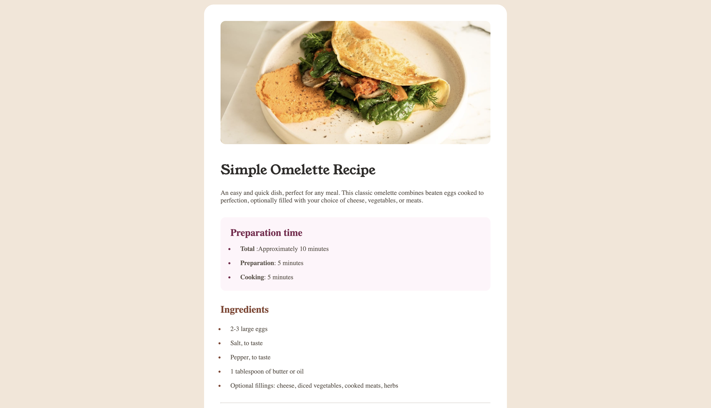
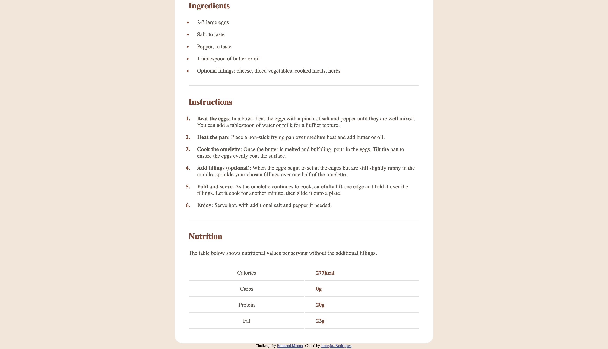

# Frontend Mentor - Recipe page solution

This is a solution to the [Recipe page challenge on Frontend Mentor](https://www.frontendmentor.io/challenges/recipe-page).

## Overview

### The challenge

This is a recipe card built from a Frontend Mentor challenge, with instructions for making an omelette.

### Screenshot

### Links

- Solution URL: [Add solution URL here](https://www.frontendmentor.io/solutions/recipe-page-solution-using-html-and-css-tYPPszOR6X)
- Live Site URL: [Add live site URL here](https://jennyrm01.github.io/recipe-page-main/)

## My process

### Built with

- Semantic HTML5 markup (`<table>`, `<strong>`)
- CSS
- Flexbox
- CSS custom properties (`:root` variables)
- `@font-face` for custom local fonts
- `::marker` for styling list bullets/numbers

### What I learned

This was my first time using `:root` custom properties and `::marker` to style list bullets/numbers, which was great to learn. I also kept practicing using DevTools throughout the project to debug and check my work.

### Challenges

The table row spacing was a real challenge — I tried switching the table to `display: grid`, but that didn't give me the result I wanted, so I went back to a regular table with padding and border-bottom instead.

### Continued development

I want to keep practicing consistently, since I took a break between challenges and noticed I'd lost a bit of the confidence and speed I had built up on my previous project. This one took longer than I expected, so I want to keep coding more regularly to stay sharp.

### AI Collaboration

I used Claude when I got stuck on parts where even searching Google didn't help me find the answer. It also helped me debug a few small typos I didn't notice myself, like spelling mistakes in my class names.

## Author

- Frontend Mentor - [@JennyRM01](https://www.frontendmentor.io/profile/JennyRM01)